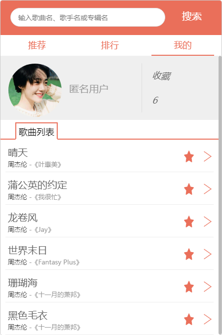
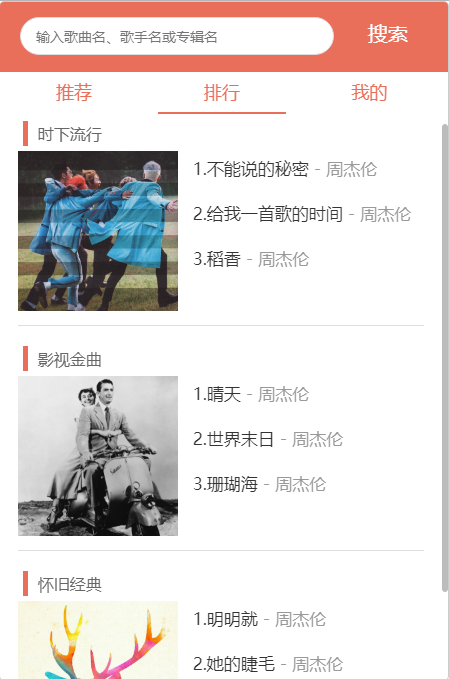
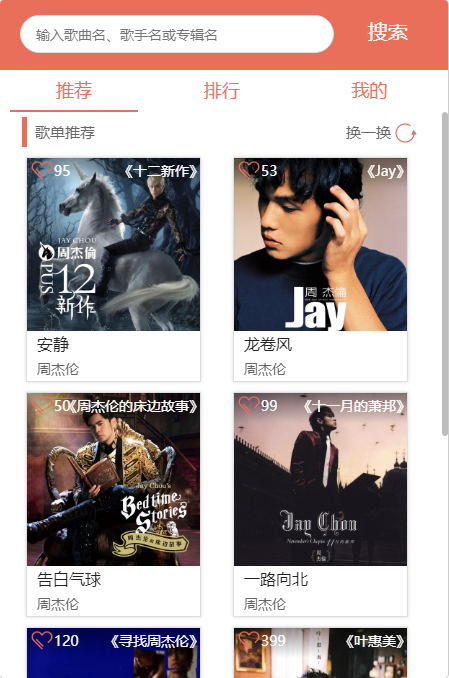
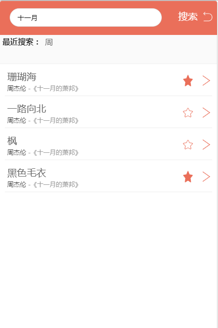
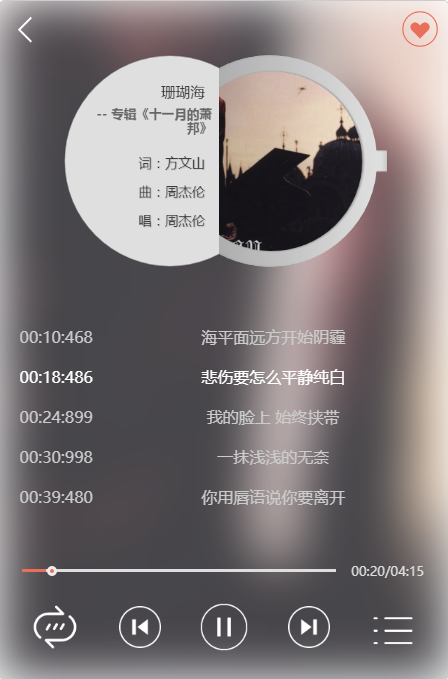
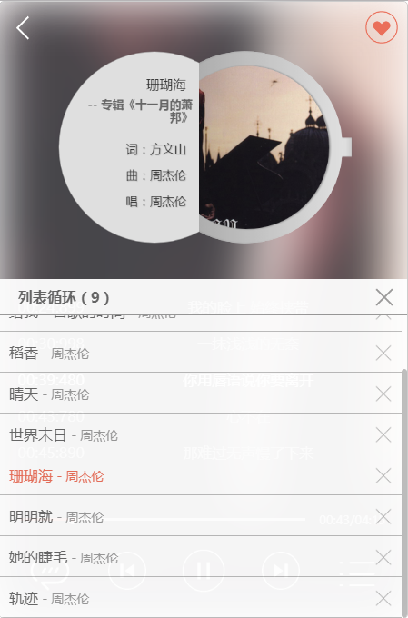
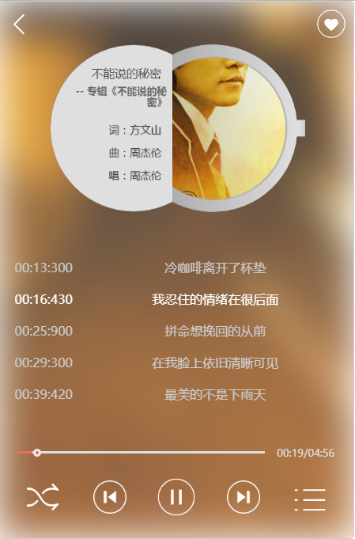
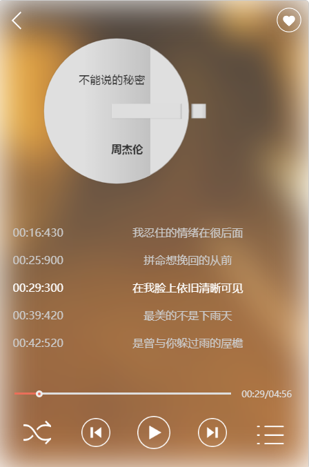

# vue-musicPlayer

### fit for web 
### 1、npm install
##### 1.1、if error, npm install vue-template-compiler
### 2、one command window: npm run dev
### 3、another command window: npm start 
### 4、open localhost:8088 in browser

